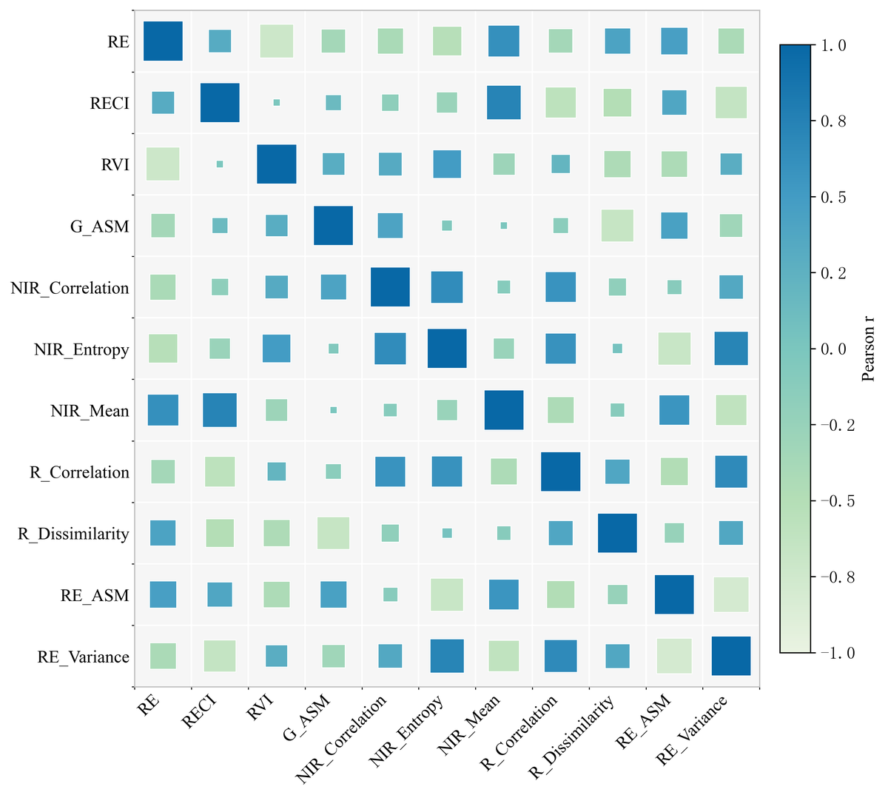
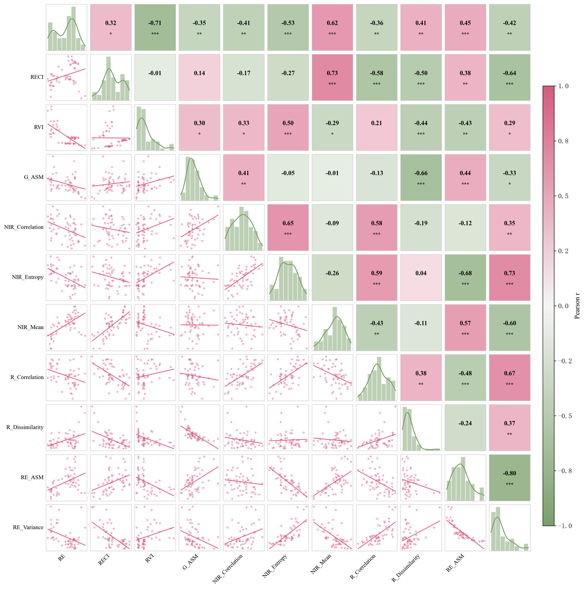

<div align="center">

# Correlation Plot

**Publication-quality correlation visualization for scientific research.**

One script → two figures → paper-ready.

</div>

---

## Demo

<div align="center">
  
  
</div>

**Left:** Correlation bubble plot — square size encodes |r|, color encodes sign and strength.
**Right:** Pairwise relationship matrix — diagonals show histograms, lower triangle shows scatter + regression, upper triangle shows r with significance stars.

---

## Quick Start

```bash
git clone https://github.com/tang200312/Correlation-Plot.git
cd Correlation-Plot
pip install -r requirements.txt
python src/plot_correlation.py
```

Output files appear in `figures/`:
- `correlation_matrix.csv` — full correlation table
- `correlation_bubble_plot.png` — bubble matrix (300 DPI)
- `pairwise_relationship_matrix.png` — multi-panel matrix (300 DPI)

---

## Features

- **Pearson correlation** with significance stars (\*\*\*p<0.001, \*\*p<0.01, \*p<0.05)
- **Bubble plot** — color-mapped squares on a clean grid, ideal for presentations
- **Pairwise matrix** — histograms (diagonal), scatter + linear fit (lower), r-values (upper)
- **Times New Roman** typography — matches most journal requirements
- **Customizable palette and DPI** — tweak constants at the top of the script
- **Works with any numeric CSV** — just swap `data/example_data.csv`

---

## Project Structure

```
Correlation-Plot/
├── src/
│   └── plot_correlation.py    # main script
├── data/
│   └── example_data.csv       # sample 11-feature dataset
├── figures/                   # output directory (auto-created)
├── requirements.txt
├── .gitignore
└── README.md
```

---

## Configuration

Edit the constants in `src/plot_correlation.py`:

| Variable | Default | Description |
|---|---|---|
| `CORR_METHOD` | `"pearson"` | Correlation method (`pearson`, `spearman`, `kendall`) |
| `FIG_DPI` | `300` | Output resolution |
| `PALETTE` | 5-color green-blue gradient | Bubble plot colormap |
| `GREEN` | `#7aa06a` | Pairwise plot — positive correlation color |
| `PINK` | `#d65a7f` | Pairwise plot — negative correlation color |

---

## Requirements

- Python 3.8+
- matplotlib, numpy, pandas, seaborn, scipy

Or install directly:

```bash
pip install matplotlib numpy pandas seaborn scipy
```

---

## License

MIT — use freely in your research.
